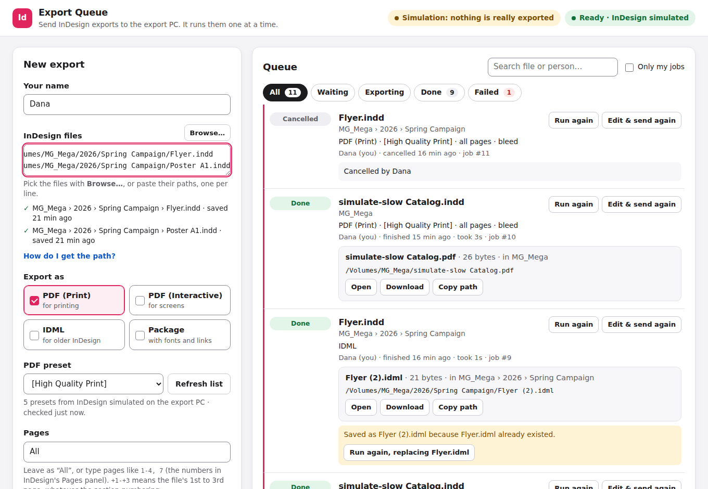
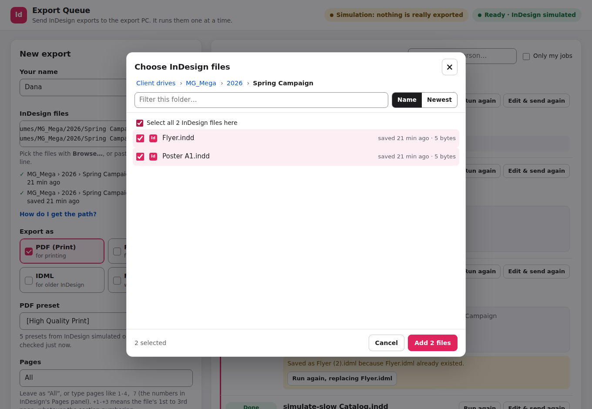
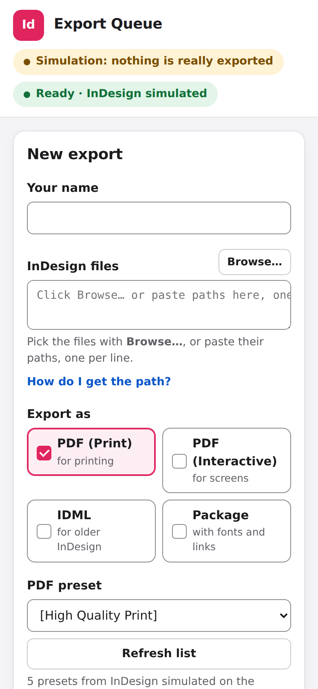

# InDesign Export Queue

Designers send InDesign exports from their own Mac or PC to the dedicated **export PC**. They open a web page, pick the files with **Browse…** (or paste paths), tick the formats, and watch the job live. When it's done they click **Open** or **Download**. The export PC runs one job at a time, so InDesign is never overloaded, and nobody has to touch the export PC.



---

## 1. Set up or upgrade the export PC

> **Sandbox first:** put the zip through your security check before you extract it. Check its SHA-256 checksum matches the one you were given: in PowerShell, `Get-FileHash .\ExportQueue.zip`. If Node.js has to be installed, the installer gets it with Windows' own `winget` (the official, signed OpenJS Foundation package). The only library, Express, is installed at the exact versions pinned in `package-lock.json`.

1. **Log in as the Windows user who runs InDesign** (on the export PC that's `ONE_Legacy`).
2. **Extract the zip onto the Desktop**, so the files end up in `Desktop\ExportQueue`. If you're upgrading, extract over the old folder and choose **Replace the files**. Your settings and job history are kept.
3. Open `ExportQueue\windows` and **double-click `Install.cmd`**. Don't use "Run as administrator"; if you do, it restarts itself as the normal user.
4. **When Windows asks "Do you want to allow this app to make changes?", click Yes.** It only asks when something needs changing. That permission is used for three things:
   - opening the firewall so office computers can reach the page (it works even if Windows thinks the office network is "Public", but only for computers on the office network);
   - removing any rule that blocks Node.js (Windows creates one if someone clicked Cancel on its firewall question);
   - stopping the PC from going to sleep on mains power (a sleeping PC exports nothing; the screen can still turn off).
5. At the end, the window shows the **address designers open**, for example `http://192.168.1.20:8080/`. It's already copied, so paste it into an email or chat to the staff. If the window says the address came from the router, ask whoever manages the router to reserve it for the export PC, so it never changes.

The installer also does the following by itself:
- finds the client drives mapped on this PC (M:, N:, X: …) and the names Macs use for them (`/Volumes/MG_Mega` …);
- makes the queue start by itself at every login, in the background, with no window that could be closed by mistake;
- creates a desktop shortcut **Export Queue** and a Start menu folder **InDesign Export Queue**.

Running `Install.cmd` again is always safe. Do it after you map a new client drive: the drive is added and nothing else changes.

**When upgrading:** if an export is running in InDesign, the installer waits for it to finish ("Waiting for job #12 to finish…"). Jobs that are waiting stay in the queue and start again after the upgrade.

**Leave the PC logged in**, or set Windows to sign in automatically. InDesign needs a logged-in desktop, so it can't run as a hidden Windows service.

### Owner controls (Start menu > InDesign Export Queue)

| Shortcut | What it does |
|---|---|
| **Open Export Queue** | Opens the page on the export PC |
| **Check Export Queue** | A checklist with a fix for every problem: Node.js, queue running, InDesign answering, each client drive, firewall, address, start at login, sleep |
| **Restart Export Queue** | Restarts it (the export in InDesign finishes first) |
| **Stop Export Queue** | Stops it until the next login or Restart (the export in InDesign finishes first) |
| **Export Queue log folder** | `server.log` (what the queue did) and `launcher.log` (starts, stops, restarts) |

If something goes wrong while nobody is looking, a **message box** appears on the export PC saying what happened and what to do. For example: the settings need fixing, Node.js is missing, another program took the port, or the queue keeps stopping.

To remove it, double-click `windows\Uninstall.cmd`. The settings and the job history are kept unless you run it with `-RemoveData`.

## 2. What designers do

1. Open the address (bookmark it) and type your name once.
2. Click **Browse…**, open a client drive and its folders, tick the InDesign files and click **Add**. You can also paste paths, one per line:
   - **Mac:** in Finder, right-click the file, hold **Option**, then **Copy "…" as Pathname**.
   - **Windows:** Shift + right-click the file, then **Copy as path**.

   Each file is checked straight away: **✓ Found** or a plain-language reason, such as "This file is on your own computer…".
3. Tick one or more formats: **PDF (Print)**, **PDF (Interactive)**, **IDML** or **Package**. Pick the PDF preset, pages, and bleed/slug. **Where to save & checks** lets you pick another folder, replace existing files, or refuse to export when links or fonts are missing.
4. Click **Add N exports to queue**. The button says how many jobs you're adding: files × formats.
5. Follow it live in **Your exports** at the top of the queue. The tab title shows a ✓ or ! count, and you can turn on a sound.
6. When it's done:
   - **Open** or **Download** the file.
   - **Copy path** copies the path in your own computer's style (`/Volumes/…` on a Mac), with a tip on how to open it.
   - **Run again** or **Edit & send again** reuse the settings.
   - **Cancel** removes a job that hasn't started.



It works on phones too:



## 3. How it keeps working (and tells you when it can't)

| Situation | What happens |
|---|---|
| InDesign is closed, starting, or showing a message | Jobs **wait** instead of failing. The page says "InDesign can't be reached on the export PC. Jobs will wait…". The queue retries every minute and carries on by itself. |
| The queue program stops unexpectedly | It restarts within 10 seconds. A job that was running is marked **failed** with the reason, and is never silently re-run. If it keeps stopping, a message box appears once, and it keeps retrying every minute. |
| PC restarts | The queue starts at login, and waiting jobs are still there. |
| Upgrade | The export in InDesign finishes first, and waiting jobs are kept. Settings, job history and the notification link are kept. |
| The file is open on the export PC with unsaved changes | The job fails with "Close it there, then run the export again". An old version is never exported. |
| Links placed on a Mac (`/Volumes/…`) | They're relinked to the same files on the export PC before exporting, and the job shows a warning that says so. |
| A client drive is disconnected | Checked every minute and shown on the page. The file is checked when you add the job and again when it runs. |
| InDesign hangs | After `jobTimeoutMinutes` the job fails with the reason. InDesign is closed so the next job can run. |
| InDesign says "done" but no file appeared | The job is marked **failed**, never "completed". |
| The export PC is off or unreachable | The page says so and reconnects by itself. |
| Wrong preset | Checked when the job is added. The job never starts with a preset that isn't installed. |
| Safety | Only files on the client drives are accepted, and `..` is refused. The page is protected against script injection. Stop/Restart only work on the export PC itself. There's an optional access key. |

## 4. Troubleshooting

Start with **Check Export Queue**. It names the problem and the fix.

| Problem | Fix |
|---|---|
| Designers can't open the page | Double-click `Install.cmd` and click **Yes** (firewall). Use the address it shows, not the PC's name. The designer's computer must be on the office network. |
| "InDesign can't be reached" | Open InDesign on the export PC, logged in as the same Windows user, and close any message it shows. |
| "The export PC doesn't have a drive called …" | Map that drive on the export PC in File Explorer (tick **Reconnect at sign-in**), then double-click `Install.cmd` again. |
| The address changed | Ask for the router to reserve the export PC's address. Until then, **Check Export Queue** shows the current one. |
| A message box about the settings | Open `config.json` in Notepad and fix the line it names. The installer's previous version is saved as `config.json.bak`. |

### `config.json` (created and updated by the installer)

| Setting | Meaning |
|---|---|
| `port`, `host` | Where the page is served (`8080`, all network cards). |
| `publicUrl` | Leave `""`: the address is worked out from the network. Set it (e.g. `"http://192.168.1.20:8080/"`) to force the address shown to people. |
| `accessKey` | Optional shared password; each browser asks for it once. |
| `drives` | The client drives shown in **Browse…**: `{ "name": "MG_Mega", "path": "\\\\192.168.1.13\\MG_Mega", "letter": "M:" }`. |
| `allowedRoots` | Folders jobs may use. Anything else is refused. In JSON, every `\` is written `\\`. |
| `pathMappings` | How designers' paths map to the export PC, e.g. `/Volumes/MG_Mega` → `\\192.168.1.13\MG_Mega`. A Mac's second mount of the same share (`/Volumes/MG_Mega-1`) is understood too. |
| `defaultOutputSubfolder` | `""` saves next to the InDesign file. A name like `"Exports"` saves in that subfolder. |
| `indesign.executor` | `"indesign"` (real). `"simulate"` is only for trying it out without InDesign. |
| `indesign.progId` | `"InDesign.Application"` uses the installed version. Use `"InDesign.Application.2026"` to force one version. |
| `indesign.jobTimeoutMinutes`, `killInDesignOnTimeout` | How long one export may take (default 60), and whether a hung InDesign is closed. |
| `retentionDays` | How long finished jobs stay in the history (default 30). |
| `ntfy` | Optional phone notifications for `failed` and/or `completed` jobs. If the **InDesign export notifier** is installed, its channel is used automatically. It also says when jobs are waiting for InDesign. |

## 5. How it's built (all free and open source)

| Layer | Choice | Why |
|---|---|---|
| Runtime | **Node.js 22.13+ LTS** | Free, and includes a SQLite database, so there's no database server to install. |
| Web server | **Express 5** ([expressjs/express](https://github.com/expressjs/express), 69k★) | The standard Node web framework, and the only third-party library. |
| Queue + history | **SQLite built into Node** | Jobs survive restarts and power cuts. A job is claimed with one atomic update, so it can never run twice. |
| Live updates | **Server-Sent Events** | Instant updates with no polling, and browsers reconnect by themselves. |
| Web page | **Plain HTML, CSS and JavaScript** | Custom-built for this workflow. No build step, no framework and no CDN. |
| InDesign control | **PowerShell → InDesign COM (`DoScript`) → ExtendScript** | Adobe's official Windows automation. The export runs synchronously, so "done" really means done. |
| Windows setup | **PowerShell 5.1** (built into Windows) | Nothing extra to install. It runs hidden in the background and shows message boxes for problems. |

**Considered and rejected:**
- **BullMQ (9.4k★):** needs a Redis server.
- **React or Vue:** add a build pipeline.
- **Render farms:** [nexrender](https://github.com/inlife/nexrender) (1.8k★) is After Effects only; nothing with 1000+ stars exists for InDesign.
- **NSSM / Windows services:** InDesign needs the logged-in desktop.

| File | Role |
|---|---|
| `src/server.js` | Start-up, health, graceful stop (exit code 5 = stopped for maintenance) |
| `src/api.js` | REST API, live events, file browser, downloads, localhost-only maintenance (`/api/admin/drain`, `resume`, `shutdown`) |
| `src/db.js`, `src/worker.js` | SQLite queue and the one-at-a-time worker (waits when InDesign is unreachable) |
| `src/paths.js`, `src/browse.js`, `src/drives.js` | Mac/Windows path translation and refusal messages, folder browsing, drive checks |
| `src/indesign.js`, `scripts/run-indesign.ps1` | The bridge to InDesign (retries while InDesign is busy) |
| `scripts/indesign-worker.jsx` | Inside InDesign: open fresh → relink Mac links → check → export → verify → close |
| `public/` | The web page |
| `windows/Install-ExportQueue.ps1` | Setup, upgrade, uninstall (`Install.cmd`, `Uninstall.cmd`) |
| `windows/launcher.ps1` | Keeps the queue running in the background; writes `launcher.log`, shows message boxes |
| `windows/Control-ExportQueue.ps1`, `Check-ExportQueue.ps1` | The Start menu's Start/Stop/Restart and Check |

## 6. What is tested

- `npm test`: 52 automated tests.
  - The server end to end, with real HTTP, a real database and real files, and a stand-in for InDesign: batches, live checks, browse, downloads, preset checks, waiting for InDesign, maintenance stop, config errors, upgrades from 1.x settings.
  - The path rules.
  - `indesign-worker.jsx` against a stand-in for InDesign's scripting model: presets, bleed and slug, open documents, Mac relinking, packages.
  - The PowerShell bridge.
- `npm run test:windows` (needs PowerShell 7 `pwsh`): 37 checks of the Windows scripts, run on Linux.
  - The settings merge (new install, upgrade from 1.x, new drive, re-run changes nothing).
  - The address choice.
  - Every launcher exit code and message box.
  - A real start → stop → start of the queue, where Stop waits for the running export.
- A 1.x job database was opened by 2.0: the old jobs and their files are listed and downloadable.
- The web page was checked in a real browser (simulation mode), at desktop and phone sizes and in dark mode: Browse, live checks, batches, waiting for InDesign, offline, cancel, search, Only my jobs, copy path (Mac style), open/download.

**Not tested:** real Windows and real InDesign weren't available in development. That covers the firewall, UAC, shortcuts, message boxes and stopping a 1.x install on Windows, plus the exports themselves. Do the first real run with a copy of a small document:
- check each format once;
- look at a PDF's bleed and page range;
- try one package.

Run **Check Export Queue** after installing.

## Development

```
npm ci
npm test
npm run test:windows        # needs pwsh
# Try it without InDesign: set "indesign": { "executor": "simulate" } and point
# "allowedRoots"/"drives" at local folders, then:
npm start
```
